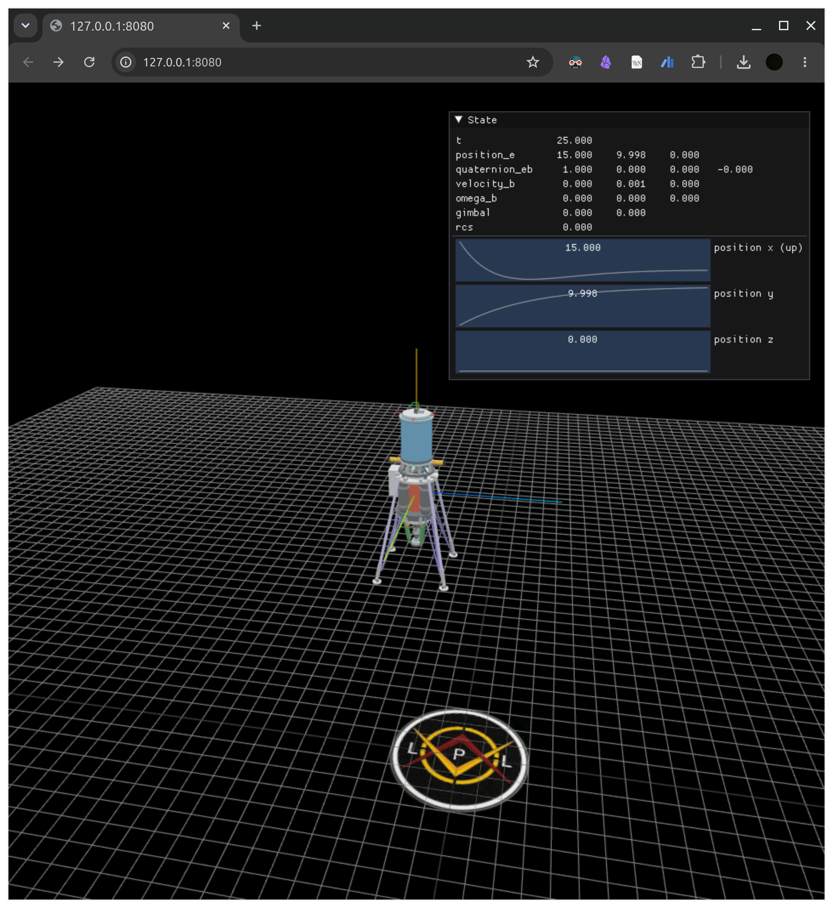
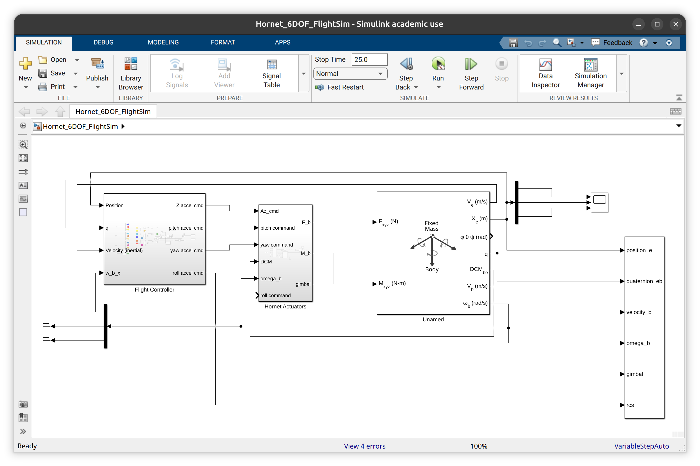
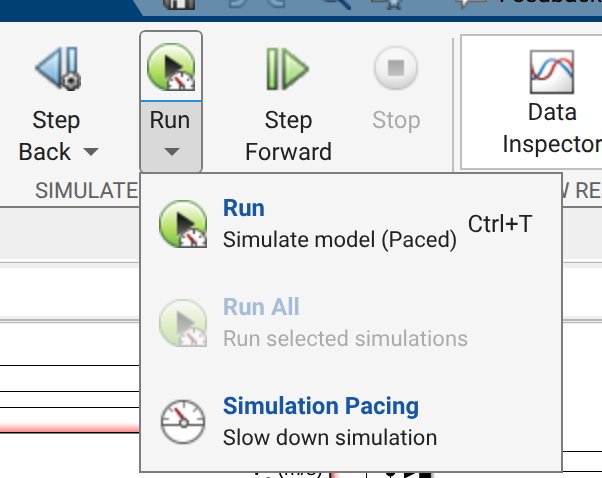

## ranger-viewer
A simple web-based tool to visualize the state of Ranger from Simulink.

> Caution: This tool requires a locally installed matlab. Web-based versions won't work.

### Usage
```
npm start
```
^ requires node. Install here: https://nodejs.org/en/download

Open http://127.0.0.1:8080 in any browser.




Hit run in Hornet simulink. 



If sim runs too fast for your monkey brain, change the sim real-time factor in Simulink here:

